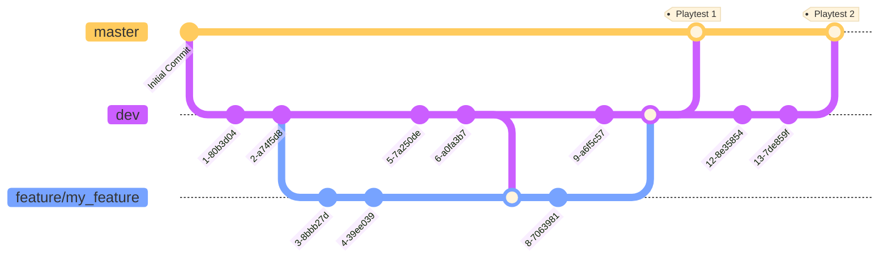

# Git workflow

Before we launch, we will be working with the following workflow. In general:
- Do not commit directly to `master`.
- Small changes can be made directly on the `dev` branch, but if you're merging into `dev` it must be in a stable state.
- Major changes requiring multiple commits should have their own `feature/[feature name]` branch
- Merges to/from `dev` can be made by anyone
- Merges to/from `master` must be approved by repository maintainters

When we get closer to launch, we'll be introducing additional branches and changes to the workflow. Namely a QA branch, a staging branch, a hot fix branch, and update tagging.
